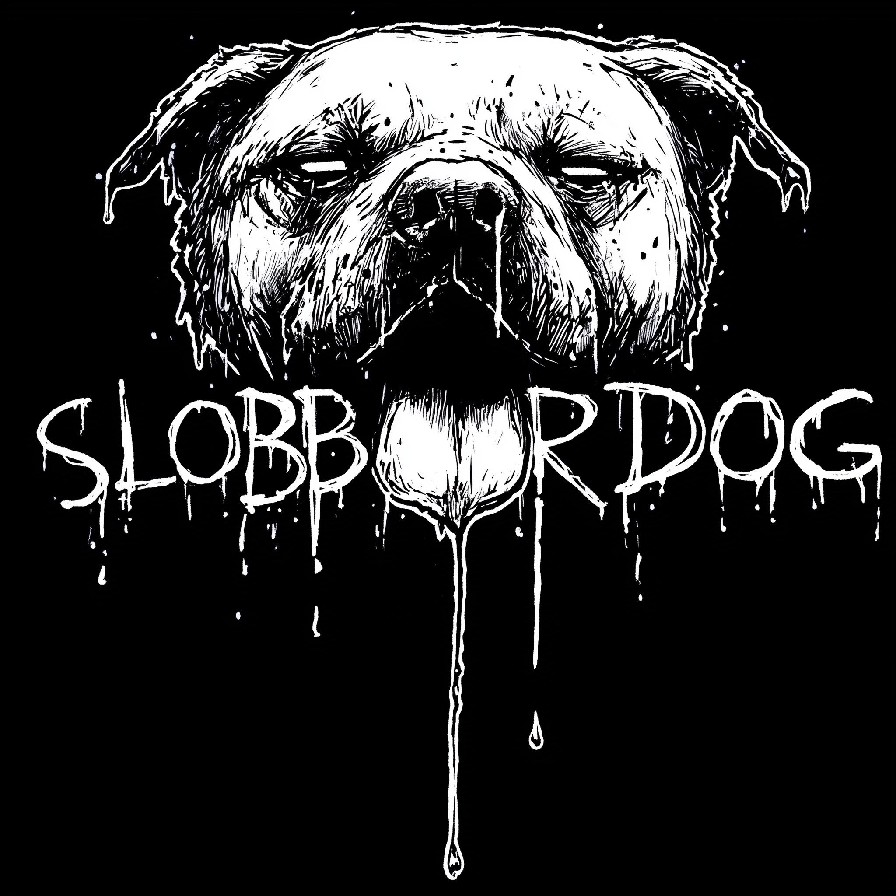

  

# SLOBBERDOG AI & Automation Services Terms

**Agentic automation, generative AI upgrades, creative technology systems and managed services**  
**Version:** 0.9  
**Date:** 18 February 2026  
**Supplier:** SLOBBERDOG, operated by **Meaghan White [ABN 87 995 443 102]**  
**Client:** **[client legal name / ABN / ACN]**  
**Project:** **[project name]**

---

## 1. Parties and engagement

| Item | Details |
|---|---|
| Supplier | **SLOBBERDOG**, a creative and technical R&D studio operated by **Meaghan White [ABN 87 995 443 102]**. |
| Client | **[client legal name]**, **[ABN/ACN]**, of **[address]**. |
| Purpose | SLOBBERDOG will design, prototype, build, integrate, operate or support agentic automation and generative AI systems for the Client, as described in the applicable Statement of Work. |
| Scope document | The project scope, milestones, fees, deliverables, dependencies, third-party tools, data handling requirements and support arrangements should be set out in a signed Statement of Work. |
| Order of precedence | If there is an inconsistency, the signed Statement of Work prevails over this document for that project only. These terms otherwise apply to the engagement. |
| Governing law | Unless the Statement of Work says otherwise, Queensland, Australia. |

---

## 2. The three-layer ownership model

SLOBBERDOG separates each engagement into three layers so ownership, access and reuse are clear.

| Layer | What it includes | Default position |
|---|---|---|
| **Project Layer** | Client materials, confidential information, brand assets, production context, internal requirements, company-specific workflow configuration, project documentation, agreed deliverables and generated outputs created for the agreed project purpose. | The Client owns its own materials and receives the rights SLOBBERDOG can grant in client-specific deliverables, subject to full payment, third-party terms and applicable law. |
| **SLOBBERDOG Core Technology Layer** | SLOBBERDOG's agentic automation engine, orchestration logic, reusable agents, software libraries, prompt frameworks, workflow patterns, APIs, dashboards, evaluation methods, infrastructure patterns, templates and general-purpose tools. | SLOBBERDOG retains ownership. The Client receives access or a licence only as required to use the agreed system for the agreed purpose. |
| **Third-Party Services Layer** | Generative AI platforms, model APIs, cloud services, media-generation tools, automation platforms, storage providers, monitoring tools and other external software or services. | Owned and controlled by the relevant third party. Use is subject to that provider's terms, pricing, availability, usage limits and policies. |

---

## 3. Definitions

**Client Materials** means all materials, information and assets supplied or made available by the Client, including scripts, briefs, footage, audio, images, branding, show materials, production notes, data, approvals, business rules, internal processes, confidential information, personal information, trade marks and other source materials.

**Client Confidential Information** means confidential information of the Client, including non-public creative, commercial, technical, operational, financial, production, talent, audience, strategy, legal, data or rights information.

**Client-Specific Deliverables** means project documents, configurations, integration mappings, bespoke reports, final outputs, and company-specific workflow descriptions created uniquely for the agreed project purpose, excluding SLOBBERDOG Technology, Third-Party Services, open-source software and pre-existing materials.

**SLOBBERDOG Technology** means all SLOBBERDOG background IP and core technology, including agentic automation engines, reusable agents, orchestration logic, software libraries, APIs, tools, dashboards, prompt frameworks, workflow patterns, testing harnesses, evaluation methods, infrastructure patterns, templates, general-purpose systems, methods, know-how and any improvements or extensions to those things.

**Third-Party Services** means external tools, platforms, providers, APIs, models, cloud services, creative tools, storage systems, automation platforms, plug-ins, libraries, open-source components and other technology not owned by SLOBBERDOG or the Client.

**Statement of Work** or **SOW** means a signed project document describing the work, deliverables, fees, timing, responsibilities and any project-specific departures from these terms.

---

## 4. Project Layer: Client ownership and control

The Client retains ownership of all Client Materials and Client Confidential Information.

Subject to full payment, third-party terms and applicable law, SLOBBERDOG assigns to the Client any rights SLOBBERDOG owns and is able to assign in the Client-Specific Deliverables created uniquely for the agreed project purpose.

This may include:

- project documentation created specifically for the Client;
- client-specific configurations and integration mappings;
- bespoke reports and workflow descriptions;
- final generated outputs prepared for the Client, to the extent SLOBBERDOG owns or can transfer rights in those outputs;
- client-specific prompt content, task instructions, approval rules and metadata schemas created around the Client's confidential operations.

This does **not** include SLOBBERDOG Technology, Third-Party Services, open-source software, general methods, generic workflow patterns, reusable prompt frameworks, reusable agents, orchestration logic, source code, infrastructure patterns or platform improvements.

---

## 5. Core Technology Layer: SLOBBERDOG ownership

SLOBBERDOG retains all rights, title and interest in SLOBBERDOG Technology.

This includes:

- technology SLOBBERDOG owns before the engagement;
- agentic automation engines, reusable agents, agent roles and task-routing methods;
- orchestration logic, APIs, dashboards, hosted services, scripts, wrappers and connectors;
- software libraries, deployment templates, infrastructure patterns and monitoring systems;
- generic prompt frameworks, reusable prompt templates, evaluation processes, safety checks, testing harnesses and quality-control methods;
- general creative automation methods, workflow patterns, research findings, operating procedures and know-how;
- improvements, extensions, refactors, bug fixes and performance upgrades to any SLOBBERDOG platform component;
- general-purpose or reusable technology, methods or patterns created during the engagement that do not incorporate or disclose Client Confidential Information.

If SLOBBERDOG exposes the Core Technology Layer through an API, endpoint, dashboard, automation, integration, hosted service, bot, script, workflow, credential, account or managed interface, that exposure is a licence or access mechanism only. It does not transfer ownership of the underlying platform, source code, logic, methods, agents, workflows or reusable components.

---

## 6. Client licence to use SLOBBERDOG Technology

SLOBBERDOG grants the Client a non-exclusive, non-transferable, non-sublicensable licence or access right to use SLOBBERDOG Technology only to the extent required to receive and use the agreed deliverables for the agreed project purpose.

Unless the Statement of Work says otherwise:

- hosted or managed access continues only while the relevant SOW, subscription, support arrangement or managed service remains active and paid;
- delivered scripts, configurations or components containing or calling SLOBBERDOG Technology may be used internally for the agreed project purpose only;
- the Client must not resell, sublicense, commercialise, reverse engineer, copy into another product, provide to a competitor, scrape, clone, benchmark for competitive development, or use SLOBBERDOG Technology to build a competing platform;
- no exclusivity is granted.

---

## 7. Third-party services and public tools

SLOBBERDOG may use or integrate Third-Party Services where they are the best tool for the job. These may include generative image, music, video or voice tools; large language model APIs; cloud services; automation platforms; storage systems; monitoring tools; or other software providers.

The parties acknowledge that:

- Third-Party Services remain owned and controlled by their providers;
- use is subject to the provider's terms, licence rules, acceptable-use policies, data policies, pricing, usage limits, availability and service changes;
- third-party providers may change pricing, features, model behaviour, account rules, content policies, rate limits, availability, API access or terms;
- SLOBBERDOG is not responsible for third-party changes, outages, restrictions, withdrawals, moderation decisions or provider-side data handling except to the extent caused by SLOBBERDOG's breach of this agreement;
- the SOW should identify approved Third-Party Services and whether they run through SLOBBERDOG accounts, Client accounts, shared workspaces or client-owned subscriptions.

No Third-Party Service should be treated as if it is owned by the project unless that provider's terms expressly allow that position.

---

## 8. Exclusivity, assignment, source code, white-labelling and self-hosting

The following rights are not included unless expressly agreed in a signed SOW and priced separately:

- exclusive access to any SLOBBERDOG platform capability, agent, workflow pattern, engine, API, method or automation;
- sector exclusivity, competitor restrictions, non-compete restrictions, or restrictions on SLOBBERDOG providing similar services to other TV, entertainment, media or creative clients;
- assignment, transfer or buy-out of SLOBBERDOG Technology or reusable platform IP;
- source-code transfer, source-code escrow, white-labelling, self-hosting, on-premises deployment or private-cloud deployment;
- custom development that must not be reused in generalised, non-confidential or de-identified form;
- perpetual hosted access independent of fees, support arrangements or infrastructure costs.

If the Client requires any of these rights, SLOBBERDOG will scope them separately. Pricing should reflect lost reuse value, lost product opportunity, added support burden, security obligations, maintenance responsibility, transition risk and any restrictions placed on SLOBBERDOG's future work.

---

## 9. Confidentiality and reuse boundaries

Each party must keep the other party's confidential information confidential and use it only for the engagement.

SLOBBERDOG will not disclose, sell, publish or reuse Client Confidential Information, Client Materials or client-specific operating context for other clients.

SLOBBERDOG may reuse general knowledge, skills, ideas, methods, patterns, lessons, generic tooling, de-identified insights and platform improvements, provided this does not disclose or depend on Client Confidential Information.

SLOBBERDOG will not intentionally train, fine-tune or build reusable models on Client Materials or Client Confidential Information unless the SOW expressly authorises this and states the permitted use.

Nothing prevents SLOBBERDOG from using skills, experience and general know-how retained in unaided memory, provided no Client Confidential Information is disclosed or reproduced.

Confidentiality obligations do not apply to information that is public, independently developed without use of confidential information, lawfully received from another source, or required to be disclosed by law.

---

## 10. Data, privacy and security

The Client is responsible for ensuring it has the right to provide Client Materials, personal information, production materials, talent materials and confidential information to SLOBBERDOG and to any approved Third-Party Services used in the project.

SLOBBERDOG will use reasonable technical and organisational measures appropriate to the nature of the project and the data handled.

The SOW should identify whether the project will process:

- personal information;
- sensitive information;
- unpublished production material;
- confidential commercial material;
- children’s information;
- biometric data;
- voice, likeness or performance data;
- rights-restricted music, footage, images, scripts or talent materials;
- regulated, legally sensitive or broadcast-sensitive content.

No highly sensitive, regulated or rights-restricted material should be put into public AI tools unless the SOW expressly authorises the tool, account structure, purpose and data-handling position.

Where information may be disclosed to overseas Third-Party Services, the SOW should record the approved providers and any privacy, security or client-consent requirements.

The Client should maintain backups of critical source materials and outputs unless backup services are expressly included in the SOW.

---

## 11. Generative AI, entertainment materials and rights clearance

Generative AI systems can produce useful drafts, treatments, music concepts, visuals, summaries, metadata, production assists and creative accelerants, but they can also produce inaccurate, non-original, rights-risky, biased, defamatory, offensive or unusable material. Human review remains required.

Unless the SOW expressly says otherwise:

- the Client is responsible for reviewing and approving outputs b	efore use in production, broadcast, publication, external distribution, advertising, talent-facing communications or commercial exploitation;
- SLOBBERDOG does not provide legal, copyright, broadcast, talent, guild, union, music, trade mark, defamation, privacy, advertising, classification, platform-compliance or insurance clearance;
- SLOBBERDOG will not knowingly create or deploy a synthetic likeness, voice, performance, identity or impersonation of a real person without explicit written approval and evidence that the Client has the required rights and consents;
- the Client must not provide scripts, music, footage, images, performances, brand assets or other materials unless it has the right to use them for the agreed AI/automation purpose;
- SLOBBERDOG does not warrant that AI-generated outputs will be copyright-protectable, registrable, exclusive, non-infringing, free from third-party claims, or suitable for broadcast or publication unless a specific clearance service is included in the SOW.

---

## 12. Delivery, acceptance and change control

Deliverables, milestones, dates, dependencies and acceptance criteria should be stated in the SOW.

Timelines assume timely Client access to systems, accounts, content, approvals, stakeholders, data and feedback.

Unless the SOW says otherwise, the Client has **five business days** after delivery to report material non-conformities against the agreed acceptance criteria. Use in production or no written rejection within that period is deemed acceptance.

Changes to scope, tools, integrations, data sources, rights-clearance requirements, security requirements, timelines or support expectations may require a written change request and additional fees.

---

## 13. Fees, third-party costs and payment

Fees are as stated in the SOW and may be fixed-fee, milestone-based, time-and-materials, subscription, retainer, managed service, usage-based or hybrid.

Unless the SOW states otherwise:

- invoices are payable within **14 days**;
- third-party subscriptions, API usage, media-generation credits, storage, cloud costs, SaaS accounts, paid plug-ins, licences and usage overages are payable by the Client unless expressly included in SLOBBERDOG's fee;
- SLOBBERDOG may suspend work or access for overdue amounts after written notice and a reasonable opportunity to remedy;
- third-party price changes, model migrations, provider restrictions or changes in usage may require price adjustment or re-scoping.

---

## 14. Support, managed services and availability

Managed services and support are provided only if included in the SOW.

Unless a specific service level is agreed, SLOBBERDOG provides support on a reasonable-efforts basis during ordinary business hours.

SLOBBERDOG may need to modify, throttle, suspend or disable a system to address security risk, misuse, provider restrictions, account issues, non-payment, excessive usage or legal/risk concerns.

Availability may depend on third-party providers, Client systems, internet services and approved accounts. Outages or restrictions in those systems are outside SLOBBERDOG's direct control.

Production-critical systems should have a support plan, incident process, monitoring arrangement, backup process, human fall-back workflow and escalation channel stated in the SOW.

---

## 15. Warranties, liability and Australian law protections

SLOBBERDOG will perform the services with due care and skill, using suitably qualified personnel or contractors.

To the extent permitted by law, SLOBBERDOG does not guarantee that any AI system or automation will be uninterrupted, error-free, secure against all threats, produce accurate outputs, achieve a particular business outcome, or remain compatible with Third-Party Services indefinitely.

Nothing in this agreement excludes, restricts or modifies rights, guarantees or remedies that cannot lawfully be excluded under the Australian Consumer Law or other applicable law.

Unless a different cap is stated in the SOW, SLOBBERDOG's aggregate liability should be capped at the fees paid or payable under the relevant SOW in the **[3/6/12] months** before the event giving rise to the claim. The parties should confirm the liability cap and any carve-outs with a solicitor before signing.

To the extent permitted by law, neither party is liable for indirect, consequential, special or punitive loss, loss of profit, loss of revenue, loss of goodwill, loss of opportunity, or loss caused by third-party service changes, except where the law does not permit exclusion.

---

## 16. Indemnities

The Client indemnifies SLOBBERDOG against third-party claims, losses, costs and expenses arising from:

- Client Materials supplied without sufficient rights or consents;
- use of outputs in production, broadcast, publication, advertising or commercial exploitation without required clearance;
- unlawful, unsafe or unauthorised instructions given by the Client;
- Client misuse of SLOBBERDOG Technology or Third-Party Services;
- breach of this agreement by the Client.

SLOBBERDOG indemnifies the Client against third-party claims, losses, costs and expenses arising from SLOBBERDOG's unauthorised disclosure of Client Confidential Information or knowing infringement of third-party IP by SLOBBERDOG Technology, excluding claims caused by Client Materials, Client instructions, Third-Party Services, open-source software, client modifications, or combinations not supplied or approved by SLOBBERDOG.

Each party must promptly notify the other of relevant claims and must not admit liability or settle a claim in a way that prejudices the other party without consent.

---

## 17. Term, termination and exit

Each SOW starts and ends on the dates stated in that SOW, unless terminated earlier.

**Termination for convenience:** **[optional: either party may terminate with 30 days' written notice, with the Client paying for completed work, committed third-party costs, non-cancellable costs and reasonable wind-down work].**

Either party may terminate for material breach not remedied within a reasonable notice period, insolvency, unlawful use, non-payment, unacceptable risk, or serious breach of confidentiality/security obligations.

On termination, the Client remains entitled to its Client Materials and accepted Client-Specific Deliverables for which it has paid. Access to SLOBBERDOG Technology, hosted systems, APIs, agents and managed services ends unless a continuing access arrangement is agreed.

Handover, data export, migration support, source-code escrow, self-hosting or transition assistance must be included in the SOW or purchased separately.

---

## 18. Publicity and case studies

SLOBBERDOG will not publicly identify the Client, disclose the project, publish a case study, use the Client's trade marks, or disclose confidential project details without the Client's prior written approval.

The parties may agree a separate public credit, launch announcement or portfolio treatment.

---

## 19. Moral rights, contractors and personnel

Each party is responsible for ensuring its personnel, contractors and contributors grant the rights and consents needed for that party to perform its obligations and for the agreed project use.

To the extent permitted by law, SLOBBERDOG will obtain from its contributors any moral rights consents reasonably required for the Client to use the Client-Specific Deliverables for the agreed project purpose. This does not require false attribution or attribution contrary to law.

The Client is responsible for obtaining equivalent rights, releases and consents for Client Materials, performers, contributors, presenters, writers, artists, voice talent, music, footage, imagery and other production materials supplied or approved by the Client.

---

## 20. Disputes

The parties should attempt to resolve disputes in good faith through senior escalation before commencing formal proceedings.

This does not prevent either party from seeking urgent injunctive relief or taking steps to protect confidential information, IP, security, data or access credentials.

---

## 21. Signing block

Signed for and on behalf of **SLOBBERDOG**:

Name: ______________________________  
Title: ______________________________  
Signature: ___________________________  
Date: _______________________________

Signed for and on behalf of **[Client legal name]**:

Name: ______________________________  
Title: ______________________________  
Signature: ___________________________  
Date: _______________________________

---

<strong>SLOBBERDOG.FYI</strong> Project-layer ownership. Platform-layer reuse. No accidental weirdness.

